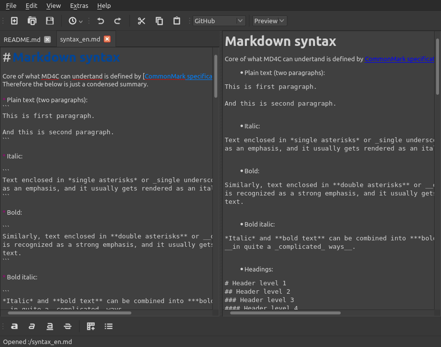

[TOC]

# About me

- I am just a boy who lives in Germany
- I love programming
- I program because it is fun
- C++ and Ubuntu = ❤️
- I don't like apps without dark mode!
- I'm very uncreative when it comes to names

# Contact

- E-Mail: sakul8826@gmail.com

# Projects

## html2md

Simple and fast HTML to Markdown conversion library with table support.

You can read the documentation [here](https://software-made-easy.github.io/html2md/).

 

## MarkdownEdit

MarkdownEdit, as the name suggests, is a simple and easy program for creating and editing Markdown files.

### Features:

- **Spell checker**
- **Import from HTML**
- **Live preview**
- Editor with **syntax highlighting**
- **Auto-completion** (close brackets, list, ...)

<a href="https://software-made-easy.github.io/MarkdownEdit/markdownedit.html" target="_blank">Click image for online demo</a>

### Wanna learn more?

More info about MarkdownEdit [here](MarkdownEdit.md).

 

## Converter

Converter is a simple app for converting strings.

### Features:

- Load from files
- Undo-Redo
- Preview converted strings in real time (<1 ms)
- Syntax highlighting editor
- Poor in resources
- Quick opening of recent files (Button in toolbar or in the file menu)
- Open source
- Native look and feel

| Convert | From         	| To                                            	|
|-------- |--------------	|-----------------------------------------------	|
|         | **Plain**    		| C-string Sorted MD5 SHA256 SHA512 	|
|         | **Markdown**  	|                 HTML Plain                 	|
|         | **HTML**     	|               Markdown Plain               	|
|         | **C-string** 		  |                     Plain                     	|

<a href="https://software-made-easy.github.io/Converter/converter.html" target="_blank">Click image for online demo</a>

### Wanna learn more?

More info about Converter [here](Converter.md).

